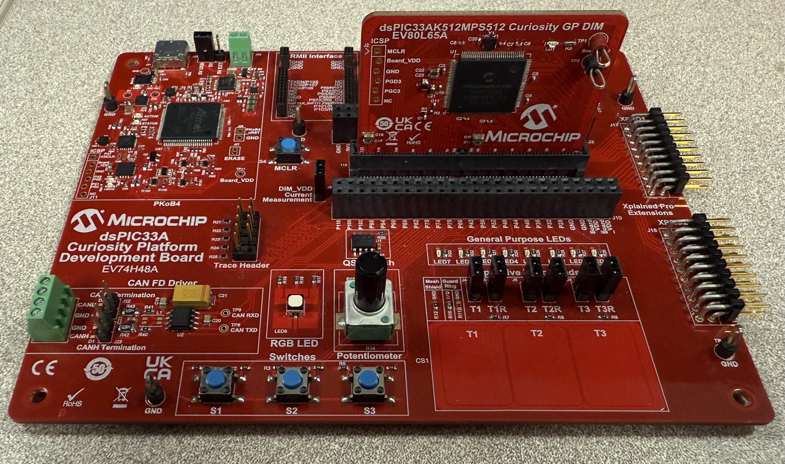
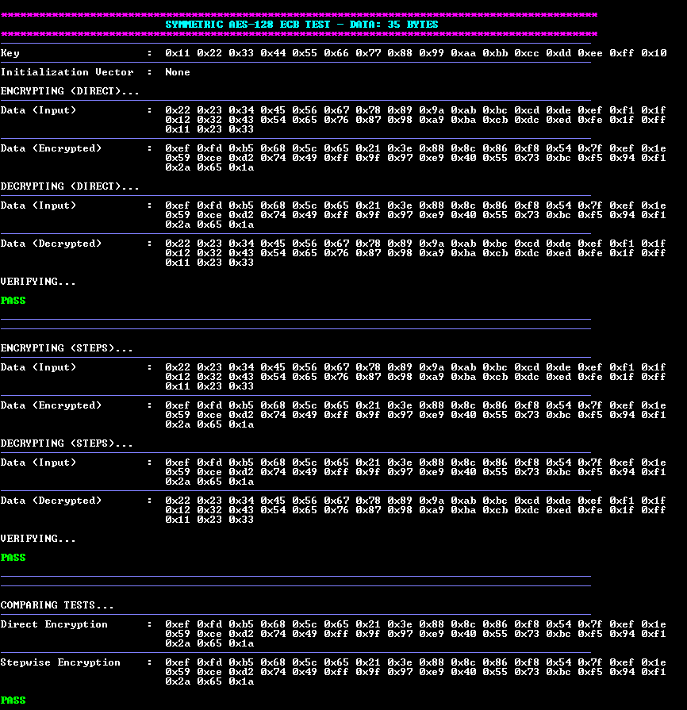
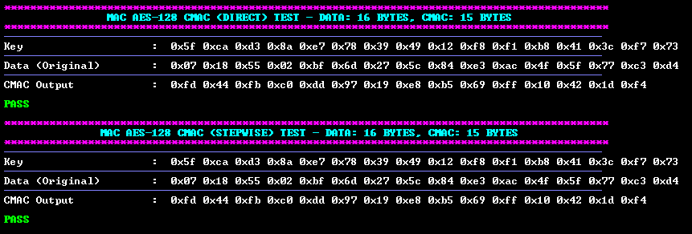
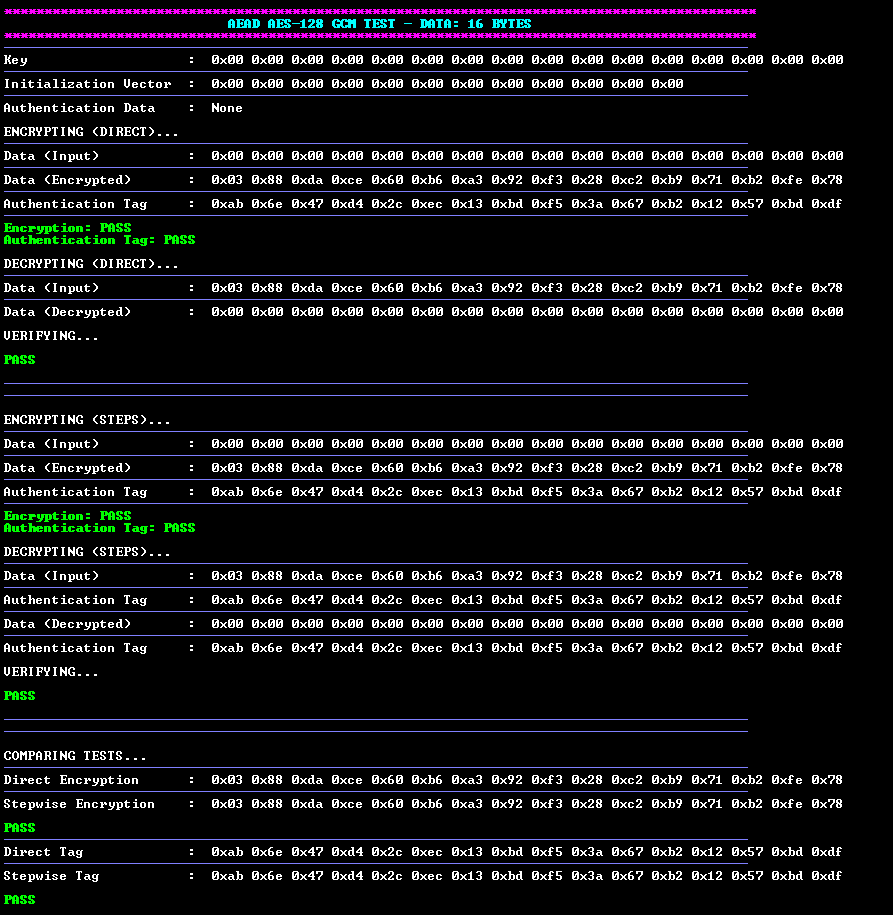
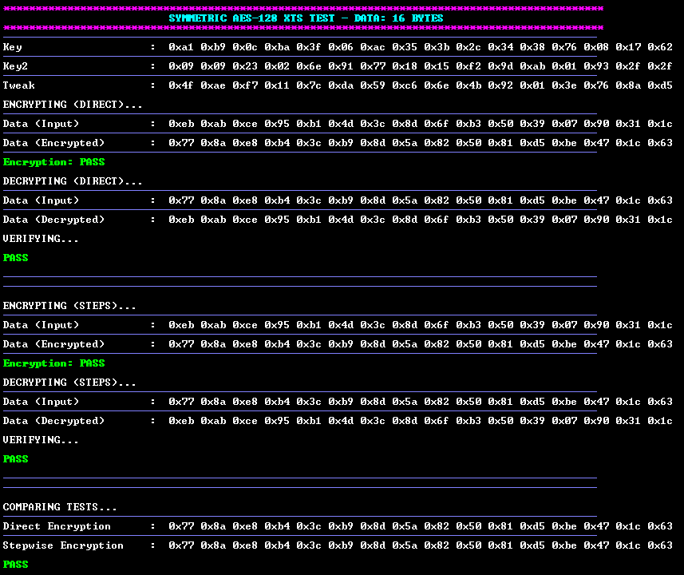

<picture>
    <source media="(prefers-color-scheme: dark)" srcset="../../images/microchip_logo_white_red.png">
    <source media="(prefers-color-scheme: light)" srcset="../../images/microchip_logo_black_red.png">
    
</picture>

# Crypto Accelerator Module AES Example Application
- Crypto Accelerator Module will be referred to as CAM throughout the remainder of the document. 

## Description
This example application utilizes the Crypto Library that interacts with the Pre-compiled CAM Hardware Driver to perform AES encryption operations using different sized input vectors. The following AES algorithms are supported:
- ECB
- CTR
- CMAC
- GCM
- XTS

## Software Tool Versions
- dsPIC33AK-MP_DEV_DFP v1.0.81
- MPLAB® X IDE [v6.25 or newer](https://www.microchip.com/mplab-x-ide)
- MPLAB® XC-DSC Compiler [v3.21 or newer](https://www.microchip.com/xcdsc)

## Setting Up The Hardware
- dsPIC33AK512MPS512 Curiosity GP DIM ([EV80L65A](https://www.microchip.com/en-us/development-tool/EV80L65A))
- Curiosity Platform Development Board ([EV74H48A](https://www.microchip.com/EV74H48A))

1. Insert the dsPIC33AK512MPS512 DIM into the DIM J1 slot on the Curiosity Platform Development Board.
2. Connect the board from the J24 USB-C PKoB4 (PICKit™ On-Board 4) to the computer.



## Running the Application
1. Within MPLAB® X IDE, open the aes.x application project in aes/firmware.
    - (Optional) To run all added test vectors uncomment the RUN_ALL_VECTORS definition on line 77 in aes/aes.X/app_aes.h
2. Build and Program the application using MPLAB® X IDE.
3. The printed information can be found on the serial COM port reading at a speed of 115200.

## Application Results
### AES ECB, CTR Results
The following information will be printed on the COM port for symmetric AES algorithms:
1. A header is displayed showing the used AES algorithm and input data length.
2. The key data is printed out.
3. The initialization vector data is printed out.
4. The data is encrypted using the single-step API.
    1. The input data is printed out
    2. The encrypted data is printed out.
5. The data is decrypted using the single-step API.
    1. The encrypted input data is printed out.
    2. The decrypted data is printed out.
    3. The decrypted data and original input data are compared.
    4. Pass or Fail is printed out depending on the comparison result.
6. The data is encrypted using the multi-step API.
    1. The input data is printed out.
    2. The encrypted data is printed out.
7. The data is decrypted using the multi-step API.
    1. The encrypted input data is printed out.
    2. The decrypted data is printed out.
    3. The decrypted data and original input data are compared.
    4. Pass or Fail is printed out depending on the comparison result.
8. The single-step and multi-step encrypted data results are compared.
    1. Pass or Fail is printed out depending on the comparison result.



### AES MAC
The following information will be printed on the COM port for AES MAC algorithms:
1. A header is displayed showing the used AES MAC algorithm and input message length.
2. The MAC is generated using the single-step API.
    1. The key data is printed out.
    2. The input data is printed out.
    3. The MAC is printed out.
    4. The result MAC and expected MAC are compared.
    5. Pass or Fail is printed out depending on the comparison result.
3. The MAC is generated using the multi-step API.
    1. The key data is printed out.
    2. The input data is printed out.
    3. The MAC is printed out.
    4. The result MAC and expected MAC are compared.
    5. Pass or Fail is printed out depending on the comparison result.



### AES GCM Results
The following information will be printed on the COM port for the AES AEAD algorithms:
1. A header is displayed showing the used AES algorithm and input data length.
2. The key data is printed out.
3. The initialization vector data is printed out.
4. The data is encrypted using the single-step API.
    1. The input data is printed out
    2. The encrypted data is printed out.
    3. The authentication tag is printed out.
    4. The encrypted data is compared to an expected value.
    5. The authentication tag is compared to an expected value.
5. The data is decrypted using the single-step API.
    1. The encrypted input data is printed out.
    2. The decrypted data is printed out.
    3. The decrypted data and original input data are compared.
    4. Pass or Fail is printed out depending on the comparison result.
6. The data is encrypted using the multi-step API.
    1. The input data is printed out.
    2. The encrypted data is printed out.
    3. The authentication tag is printed out.
    4. The encrypted data is compared to an expected value.
    5. The authentication tag is compared to an expected value.
7. The data is decrypted using the multi-step API.
    1. The encrypted input data is printed out.
    2. The authentication tag is printed out.
    3. The decrypted data is printed out.
    4. The authentication tag is printed out.
    5. The decrypted data and original input data are compared.
    6. Pass or Fail is printed out depending on the comparison result.
8. The single-step and multi-step encrypted data results are compared.
    1. Pass or Fail is printed out depending on the comparison result.



### AES XTS Results
The following information will be printed on the COM port for symmetric AES XTS algorithm:
1. A header is displayed showing the used AES algorithm and input data length.
2. The key data is printed out.
3. The key 2 data is printed out.
4. The tweak data is printed out.
4. The data is encrypted using the single-step API.
    1. The input data is printed out
    2. The encrypted data is printed out.
    3. The encrypted data is compared to an expected value.
5. The data is decrypted using the single-step API.
    1. The encrypted input data is printed out.
    2. The decrypted data is printed out.
    3. The decrypted data and original input data are compared.
    4. Pass or Fail is printed out depending on the comparison result.
6. The data is encrypted using the multi-step API.
    1. The input data is printed out.
    2. The encrypted data is printed out.
    4. The encrypted data is compared to an expected value.
7. The data is decrypted using the multi-step API.
    1. The encrypted input data is printed out.
    3. The decrypted data is printed out.
    5. The decrypted data and original input data are compared.
    6. Pass or Fail is printed out depending on the comparison result.
8. The single-step and multi-step encrypted data results are compared.
    1. Pass or Fail is printed out depending on the comparison result.



## Crypto Library APIs

### AES ECB, CTR, XTS APIs
crypto_sym_cipher.h defines Init, Cipher, EncryptDirect, and DecryptDirect APIs.

Inputs to these functions must be **little endian**.

```c
crypto_Sym_Status_E Crypto_Sym_Aes_Init(
    st_Crypto_Sym_BlockCtx *ptr_aesCtx_st, // configuration context for Symmetric AES support
    crypto_HandlerType_E handlerType_en,   // configure Crypto API to use hardware acceleration
    crypto_CipherOper_E cipherOpType_en,   // configure AES to encrypt or decrypt
    crypto_Sym_OpModes_E opMode_en,        // configure type of AES algorithm
    uint8_t *ptr_key,                      // pointer to the key data array to be used
    uint32_t keyLen,                       // length of the key data array
    uint8_t *ptr_initVect,                 // pointer to the initialization vector data array to be used
    uint32_t sessionID                     // session ID for use by Crypto API (maximum of 1)
);
```

```c
crypto_Sym_Status_E Crypto_Sym_Aes_Cipher(
    st_Crypto_Sym_BlockCtx *ptr_aesCtx_st, // configuration context for AES support
    uint8_t *ptr_inputData,                // pointer to the input data array to be encrypted/decrypted
    uint32_t dataLen,                      // length of the input message array
    uint8_t *ptr_outData                   // pointer to the data array for encrypted/decrypted output to be stored
);
```

```c
crypto_Sym_Status_E Crypto_Sym_AesXts_Cipher(
    st_Crypto_Sym_BlockCtx *ptr_aesCtx_st, // configuration context for AES support
    uint8_t *ptr_inputData,                // pointer to the input data array to be encrypted/decrypted
    uint32_t dataLen,                      // length of the input message array
    uint8_t *ptr_outData,                  // pointer to the data array for encrypted/decrypted output to be stored
    uint8_t *ptr_tweak                     // pointer to the tweak array used to adjust the result ciphertext
);
```

```c
crypto_Sym_Status_E Crypto_Sym_Aes_EncryptDirect(
    crypto_HandlerType_E handlerType_en,   // configure Crypto API to use hardware acceleration
    crypto_Sym_OpModes_E opMode_en,        // configure type of AES algorithm
    uint8_t *ptr_inputData,                // pointer to the input data array to be encrypted
    uint32_t dataLen,                      // length of the input data array
    uint8_t *ptr_outData,                  // pointer to the data array for encrypted output to be stored
    uint8_t *ptr_key,                      // pointer to the key data array to be used
    uint32_t keyLen,                       // length of the key data array
    uint8_t *ptr_initVect,                 // pointer to the initialization vector data array to be used
    uint32_t sessionID                     // session ID for use by Crypto API (maximum of 1)
);
```

```c
crypto_Sym_Status_E Crypto_Sym_Aes_DecryptDirect(
    crypto_HandlerType_E handlerType_en,   // configure Crypto API to use hardware acceleration
    crypto_Sym_OpModes_E opMode_en,        // configure type of AES algorithm 
    uint8_t *ptr_inputData,                // pointer to the encrypted input data array to be decrypted
    uint32_t dataLen,                      // length of the encrypted input data array
    uint8_t *ptr_outData,                  // pointer to the data array for decrypted output to be stored
    uint8_t *ptr_key,                      // pointer to the key data array to be used
    uint32_t keyLen,                       // length of the key data array
    uint8_t *ptr_initVect,                 // pointer to the initialization vector data array to be used
    uint32_t sessionID                     // session ID for use by Crypto API (maximum of 1)
);      
```


### AES MAC APIs
crypto_mac_cipher.h defines Init, Cipher, Final, and Direct APIs.

```c
crypto_Mac_Status_E Crypto_Mac_AesCmac_Init(
    st_Crypto_Mac_Aes_ctx *ptr_aesCmacCtx_st,   // CMAC context structure used to store values
    crypto_HandlerType_E handlerType_en,        // configure Crypto API to use hardware acceleration
    uint8_t *ptr_key,                           // pointer to the key data array to be used
    uint32_t keyLen,                            // length of the key data array
    uint32_t sessionID                          // session ID for use by the Crypto API (maximum of 1)
);
```    

```c
crypto_Mac_Status_E Crypto_Mac_AesCmac_Cipher(
    st_Crypto_Mac_Aes_ctx *ptr_aesCmacCtx_st,   // CMAC context structure used to store values
    uint8_t *ptr_inputData,                     // pointer to the input message to generate CMAC with
    uint32_t dataLen                            // length of the input message
);
```

```c
crypto_Mac_Status_E Crypto_Mac_AesCmac_Final(
    st_Crypto_Mac_Aes_ctx *ptr_aesCmacCtx_st,   // CMAC context structure used to store values
    uint8_t *ptr_outMac,                        // output pointer to generate the CMAC to
    uint32_t macLen                             // length of the requested CMAC
);
```

```c
crypto_Mac_Status_E Crypto_Mac_AesCmac_Direct(
    crypto_HandlerType_E macHandlerType_en,     // configure Crypto API to use hardware acceleration
    uint8_t *ptr_inputData,                     // pointer to the input message to generate CMAC with
    uint32_t dataLen,                           // length of the input message
    uint8_t *ptr_outMac,                        // output pointer to generate the CMAC to
    uint32_t macLen,                            // length of the requested CMAC
    uint8_t *ptr_key,                           // pointer to the key data array to be used
    uint32_t keyLen,                            // length of the key data array
    uint32_t sessionID                          // session ID for use by the Crypto API (maximum of 1)
);
```

### AES GCM APIs
```c
crypto_Aead_Status_E Crypto_Aead_AesGcm_Init(
    st_Crypto_Aead_AesGcm_ctx *ptr_aesGcmCtx_st,     // configuration context for AES GCM support
    crypto_HandlerType_E handlerType_en,             // configure Crypto API to use hardware acceleration
    crypto_CipherOper_E cipherOper_en,               // configure AES to encrypt or decrypt
    uint8_t *ptr_key,                                // pointer to the key data array to be used
    uint32_t keyLen,                                 // length of the key data array
    uint8_t *ptr_initVect,                           // pointer to the initialization vector data array to be used
    uint32_t initVectLen,                            // length of the initialization vector data array
    uint32_t sessionID                               // session ID for use by the Crypto API (maximum of 1)
    );
```

```c
crypto_Aead_Status_E Crypto_Aead_AesGcm_AddAadData(
    st_Crypto_Aead_AesGcm_ctx *ptr_aesGcmCtx_st,     // configuration context for AES GCM support
    uint8_t *ptr_aad,                                // pointer to the aad data array to be used
    uint32_t aadLen                                  // length of the aad data array
);
```

```c
crypto_Aead_Status_E Crypto_Aead_AesGcm_Cipher(
    st_Crypto_Aead_AesGcm_ctx *ptr_aesGcmCtx_st,     // configuration context for AES GCM support
    uint8_t *ptr_inputData,                          // pointer to the input data array to be used
    uint32_t dataLen,                                // length of the input data array
    uint8_t *ptr_outData                             // pointer to the data array for encrypted/decrypted output to be stored
);
```

```c
crypto_Aead_Status_E Crypto_Aead_AesGcm_Final(
    st_Crypto_Aead_AesGcm_ctx *ptr_aesGcmCtx_st,     // configuration context for AES GCM support
    uint8_t *ptr_authTag,                            // pointer to the authentication tag data array to be used
    uint8_t authTagLen                               // length of the authentication tag data array
);
```

```c
crypto_Aead_Status_E Crypto_Aead_AesGcm_EncryptAuthDirect(
    crypto_HandlerType_E handlerType_en,           // configure Crypto API to use hardware acceleration
    uint8_t *ptr_inputData,                        // pointer to the input data array to be used
    uint32_t dataLen,                              // length of the input data array
    uint8_t *ptr_outData,                          // pointer to the data array for encrypted output to be stored
    uint8_t *ptr_key,                              // pointer to the key data array to be used
    uint32_t keyLen,                               // length of the key data array
    uint8_t *ptr_initVect,                         // pointer to the initialization vector data array to be used
    uint32_t initVectLen,                          // length of the initialization vector data array
    uint8_t *ptr_aad,                              // pointer to the aad data array to be used
    uint32_t aadLen,                               // length of the aad data array
    uint8_t *ptr_authTag,                          // pointer to the authentication tag data array to be used
    uint8_t authTagLen,                            // length of the authentication tag data array
    uint32_t sessionID                             // session ID for use by the Crypto API (maximum of 1)
);
```

```c
crypto_Aead_Status_E Crypto_Aead_AesGcm_DecryptAuthDirect(
    crypto_HandlerType_E handlerType_en,           // configure Crypto API to use hardware acceleration
    uint8_t *ptr_inputData,                        // pointer to the input data array to be used
    uint32_t dataLen,                              // length of the input data array
    uint8_t *ptr_outData,                          // pointer to the data array for decrypted output to be stored
    uint8_t *ptr_key,                              // pointer to the key data array to be used
    uint32_t keyLen,                               // length of the key data array
    uint8_t *ptr_initVect,                         // pointer to the initialization vector data array to be used
    uint32_t initVectLen,                          // length of the initialization vector data array
    uint8_t *ptr_aad,                              // pointer to the aad data array to be used
    uint32_t aadLen,                               // length of the aad data array
    uint8_t *ptr_authTag,                          // pointer to the authentication tag data array to be used
    uint8_t authTagLen,                            // length of the authentication tag data array
    uint32_t sessionID                             // session ID for use by the Crypto API (maximum of 1)
);
```

## Benchmarking

### Performance Benchmarking
The following benchmarking results were obtained while testing the AES driver with NIST provided test vectors.

Benchmarking parameters: Device clock speed set to 200 MHz

#### AES-ECB
|Key Size (bytes)|Plaintext Size (bytes)|AES-ECB Crypto_Sym_Aes_EncryptDirect Performance (Mbps)|
|----|----|----|
|16|8192|435.51|
|24|8192|372.07|
|32|8192|324.79|

|Key Size (bytes)|Ciphertext Size (bytes)|AES-ECB Crypto_Sym_Aes_DecryptDirect Performance (Mbps)|
|----|----|----|
|16|8192|434.36|
|24|8192|371.27|
|32|8192|324.11|

#### AES-CTR
|Key Size (bytes)|Initialization Vector Size (bytes)|Plaintext Size (bytes)|AES-CTR Crypto_Sym_Aes_EncryptDirect Performance (Mbps)|
|----|----|----|----|
|16|16|8192|435.26|
|24|16|8192|372.08|
|32|16|8192|324.94|

|Key Size (bytes)|Initialization Vector Size (bytes)|Ciphertext Size (bytes)|AES-CTR Crypto_Sym_Aes_DecryptDirect Performance (Mbps)|
|----|----|----|----|
|16|16|8192|435.35|
|24|16|8192|372.18|
|32|16|8192|324.96|

#### AES-GCM
|Key Size (bytes)|Initialization Vector Size (bytes)|Authentication Data Size (bytes)|Tag Size (bytes)|Plaintext Size (bytes)|AES-GCM Crypto_Aead_AesGcm_EncryptAuthDirect Performance (Mbps)|
|----|----|----|----|----|----|
|16|12|4|16|8192|420.99|
|24|12|4|16|8192|361.49|
|32|12|4|16|8192|316.61|

|Key Size (bytes)|Initialization Vector Size (bytes)|Authentication Data Size (bytes)|Tag Size (bytes)|Ciphertext Size (bytes)|AES-GCM Crypto_Aead_AesGcm_DecryptAuthDirect Performance (Mbps)|
|----|----|----|----|----|----|
|16|12|4|16|8192|417.59|
|24|12|2|16|8192|358.91|
|32|12|2|16|8192|314.69|

#### AES-XTS
|Key Size (bytes)|Tweak Size (bytes)|Plaintext Size (bytes)|AES-XTS Crypto_Sym_Aes_EncryptDirect Performance (Mbps)|
|----|----|----|----|
|16|16|8192|429.99|
|32|16|8192|321.66|

|Key Size (bytes)|Tweak Size (bytes)|Ciphertext Size (bytes)|AES-XTS Crypto_Sym_Aes_DecryptDirect Performance (Mbps)|
|----|----|----|----|
|16|16|8192|429.20|
|32|16|8192|321.13|

#### AES-CMAC
|Key Size (bytes)|Plaintext Size (bytes)|MAC Size (bytes)|AES-CMAC Crypto_Mac_AesCmac_Direct Performance (Mbps)|
|----|----|----|----|
|16|8192|16|21.56|
|24|8192|16|21.41|
|32|8192|16|21.13|

### Memory Size Benchmarking
The following results include usage of ECB, CTR, GCM, XTS, and CMAC APIs. Flash size will vary based on size of the stored data inputs used with the library. 

#### Single Step

|AES Mode|RAM (bytes)|FLASH (bytes)|
|----|----|----|
|AES-ECB|58|11,788|
|AES-CTR|58|11,828|
|AES-GCM|58|12,204|
|AES-XTS|58|11,828|
|AES-CMAC|58|10,736|

#### Multi Step

|AES Mode|RAM (bytes)|FLASH (bytes)|
|----|----|----|
|AES-ECB|2,006|11,852|
|AES-CTR|2,006|11,896|
|AES-GCM|598|12,328|
|AES-XTS|2,006|11,896|
|AES-CMAC|586|10,792|

## ACVP
The APIs have been self-tested according to the NIST ACVP specification and generated test vectors. More information can be found [here](https://pages.nist.gov/ACVP/).