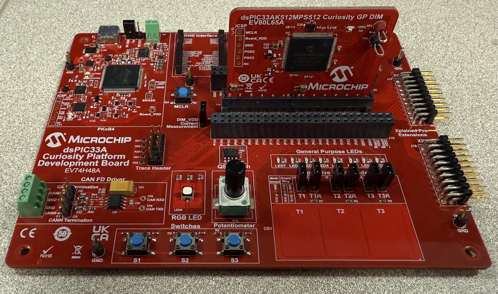
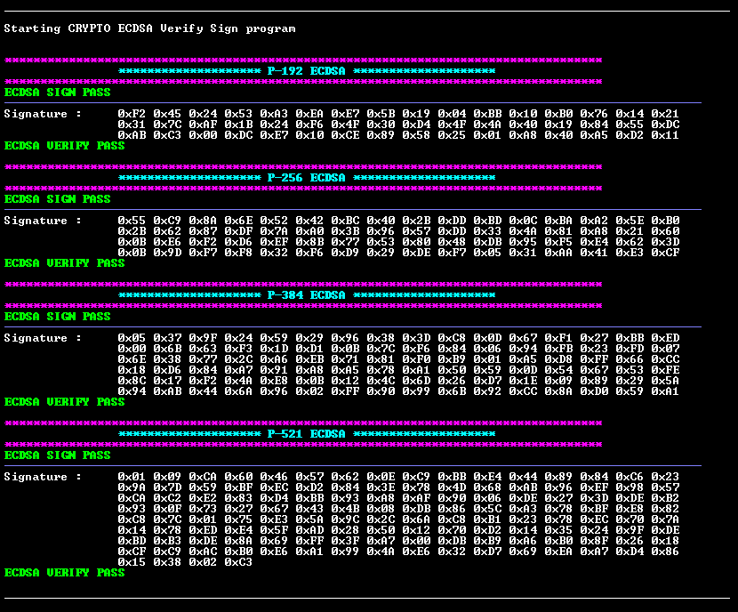

# Crypto Accelerator Module ECDSA Sign and Verify Example Application
## Description
This example application utilizes Crypto APIs that interact with the Crypto Accelerator Module pre-compiled library to perform ECDSA Sign and Verify operations.

The ECDSA Sign and Verify operations use NIST defined public and private keys for the following ECC curves:
- P-192
- P-256
- P-384
- P-521

## Software Tool Versions
- dsPIC33AK-MP_DFP v1.0.81
- MPLAB® X IDE [v6.25 or newer](https://www.microchip.com/mplab-x-ide)
- MPLAB® XC-DSC Compiler [v3.21 or newer](https://www.microchip.com/xcdsc)

## Setting Up The Hardware
- dsPIC33AK512MPS512 Curiosity GP DIM (EV80L65A)
- Curiosity Platform Development Board ([EV74H48A](https://www.microchip.com/EV74H48A))

1. Insert the dsPIC33AK512MPS512 DIM into the DIM J1 slot on the Curiosity Platform Development Board.
2. Connect the the board from the J24 USB-C PKoB4 (PICKit™ On-Board 4) to the computer.



## Running The Application
1. Within MPLAB® X IDE, open the dsa.x application project in dsa/firmware.
2. Build and Program the application using MPLAB® X IDE.
3. The printed information can be found on the serial COM port reading at a speed of 115200.

### Application Results
The following information will be printed on the COM port for all supported ECC Curve types:
1. A header Section with the ECC curve type name is printed.
2. The signature is generated. (A status of the Crypto Device will be returned and printed)
3. Generated signature is printed out.
4. This signature is then verified and the status is printed out.



## ECDSA Sign and Verify API Documentation
crypto_digisign.h defines sign and verify functions

- Inputs to these functions must be **big endian**.

```c
crypto_DigiSign_Status_E Crypto_DigiSign_Ecdsa_Sign(
    crypto_HandlerType_E ecdsaHandlerType_en,   // The type of crypto implementation to use 
    uint8_t *ptr_inputHash,                     // A pointer to a Hash output generated with SHA
    uint32_t hashLen,                           // Length of the generated Hash
    uint8_t *ptr_outSig,                        // A pointer to store the output Signature
    uint32_t sigLen,                            // Length of the expected Signature
    uint8_t *ptr_privKey,                       // Private Key to sign the message with
    uint32_t privKeyLen,                        // Length of the Private Key
    crypto_EccCurveType_E eccCurveType_En,      // Type of curve being used (described below)
    uint32_t ecdsaSessionId                     // Session ID (This is set to 1)
);
```

```c
crypto_DigiSign_Status_E Crypto_DigiSign_Ecdsa_Verify(
    crypto_HandlerType_E ecdsaHandlerType_en,   // The type of crypto implementation to use 
    uint8_t *ptr_inputHash,                     // A pointer to a Hash output generated with SHA
    uint32_t hashLen,                           // Length of the generated Hash
    uint8_t *ptr_inputSig,                      // A pointer given Signature
    uint32_t sigLen,                            // Length of the Signature
    uint8_t *ptr_pubKey,                        //  Public Key to verify the signature
    uint32_t pubKeyLen,                         // Length of the Public Key
    int8_t *ptr_sigVerifyStat,                  // Status bit to indicate a successful verification
    crypto_EccCurveType_E eccCurveType_En,      // Type of curve being used(described below)
    uint32_t ecdsaSessionId                     // Session ID (This is set to 1)
);
```

### crypto_EccCurveType_E can be any of the following enum values:
- CRYPTO_ECC_CURVE_P192
- CRYPTO_ECC_CURVE_P256
- CRYPTO_ECC_CURVE_P384
- CRYPTO_ECC_CURVE_P521

## NIST Vectors
The input test vectors used in this demo are from NIST Publication: [FIPS 186-4 ECDSA Algorithm Test Vectors](https://csrc.nist.gov/projects/cryptographic-algorithm-validation-program/digital-signatures)

Hash values used in this demo are from NIST [Cryptographic Standards and Guidelines](https://csrc.nist.gov/projects/cryptographic-standards-and-guidelines/example-values) and can be found under the Secure Hashing section for all Digest Sizes.

## Benchmarking Results

### Performance Benchmarking
Benchmarking parameters: Device clock speed set to 200 MHz.

|ECC Curve|Crypto_DigiSign_Ecdsa_Verify (ms)|
|----|----|
|P-192|5.14|
|P-256|9.90|
|P-384|27.07|
|P-521|58.35|

### Size Benchmarking
The following results are using P-521. Flash size will vary based on size of the stored data inputs used with the library. 

|RAM (bytes)|FLASH (bytes)|
|----|----|
|4,108|10,536|