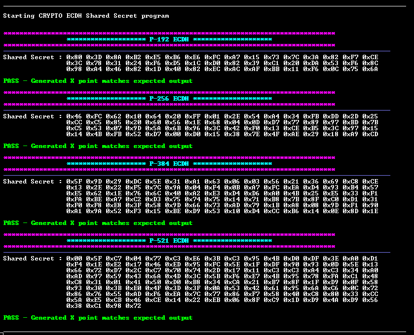

<picture>
    <source media="(prefers-color-scheme: dark)" srcset="../../images/microchip_logo_white_red.png">
    <source media="(prefers-color-scheme: light)" srcset="../../images/microchip_logo_black_red.png">
    
</picture>

# Crypto Accelerator Module ECDH Shared Secret Generation Example Application
- Crypto Accelerator Module will be referred to as CAM throughout the remainder of the document. 

## Description
This example application utilizes Crypto Library that interacts with the Pre-compiled CAM Hardware Driver to perform ECDH Shared Secret operations.

The ECDH Shared Secret Generation use NIST defined public and private keys for the following ECC curves:
- P-192
- P-256
- P-384
- P-521

## Software Tool Versions
- dsPIC33AK-MP_DFP v1.0.81
- MPLAB® X IDE [v6.25 or newer](https://www.microchip.com/mplab-x-ide)
- MPLAB® XC-DSC Compiler [v3.21 or newer](https://www.microchip.com/xcdsc)

## Setting Up The Hardware
- dsPIC33AK512MPS512 Curiosity GP DIM ([EV80L65A](https://www.microchip.com/en-us/development-tool/EV80L65A))
- Curiosity Platform Development Board ([EV74H48A](https://www.microchip.com/EV74H48A))

1. Insert the dsPIC33AK512MPS512 DIM into the DIM J1 slot on the Curiosity Platform Development Board.
2. Connect the the board from the J24 USB-C PKoB4 (PICKit™ On-Board 4) to the computer.


## Running The Application
1. Within MPLAB® X IDE, open the ecdh.x application project in ecdh/firmware.
2. Build and Program the application using MPLAB® X IDE.
3. The printed information can be found on the serial COM port reading at a speed of 115200.

### Application Results
The following information will be printed on the COM port for all supported ECC Curve types:
1. A header section with the ECC curve type name is printed.
2. The Shared Secret is generated.
3. Generated Shared Secret is printed out.
4. This Shared Secret X point value is compared to the expected output from **NIST** and the status is printed out.



## Crypto Library APIs
crypto_kas.h defines the Shared Secret Generation function

- Inputs to these functions must be **big endian**.

```c
crypto_Kas_Status_E Crypto_Kas_Ecdh_SharedSecret(
    crypto_HandlerType_E ecdhHandlerType_en,    // The type of crypto implementation to use (CRYPTO_HANDLER_HW_INTERNAL is the only supported input for this implementation)
    uint8_t *ptr_privKey,                       // Private Key to perform ECDH operation with
    uint32_t privKeyLen,                        // Length of the Private Key
    uint8_t *ptr_pubKey,                        // Public Key to perform ECDH operation with (An prepended KeyType is not implemented, Uncompressed key format is required)
    uint32_t pubKeyLen,                         // Length of the Public Key
    uint8_t *ptr_sharedSecret,                  // Shared Secret output X component.
    uint32_t sharedSecretLen,                   // Length of the Shared Secret (Typically twice the size of the private key)
    crypto_EccCurveType_E eccCurveType_en,      // Type of curve being used (described below)
    uint32_t ecdhSessionId                      // Session ID (This is set to 1)
);
```

### crypto_EccCurveType_E can be any of the following enum values:
- CRYPTO_ECC_CURVE_P192
- CRYPTO_ECC_CURVE_P256
- CRYPTO_ECC_CURVE_P384
- CRYPTO_ECC_CURVE_P521

## NIST Vectors
The input test vectors used in this demo are from NIST Publication: [SP 800-56A ECCCDH Primitive Test Vectors](https://csrc.nist.gov/projects/cryptographic-algorithm-validation-program/component-testing)

## Benchmarking Results

### Performance Benchmarking
Benchmarking parameters: Device clock speed set to 200 MHz.

|ECC Curve|Crypto_Kas_Ecdh_SharedSecret Performance (ms)|
|----|----|
|P-192|3.78|
|P-256|7.22|
|P-384|19.44|
|P-521|41.55|

### Memory Size Benchmarking
Flash size will vary based on size of the stored data inputs used with the library. 

|ECC Curve|RAM (bytes)|FLASH (bytes)|
|----|----|----|
|P-192|4,152|10,744|
|P-256|4,152|10,788|
|P-384|4,152|10,856|
|P-521|4,152|10,928|

## ACVP
The ECDH Shared Secret API has been self-tested according to the NIST ACVP specification and generated test vectors. More information can be found [here](https://pages.nist.gov/ACVP/).