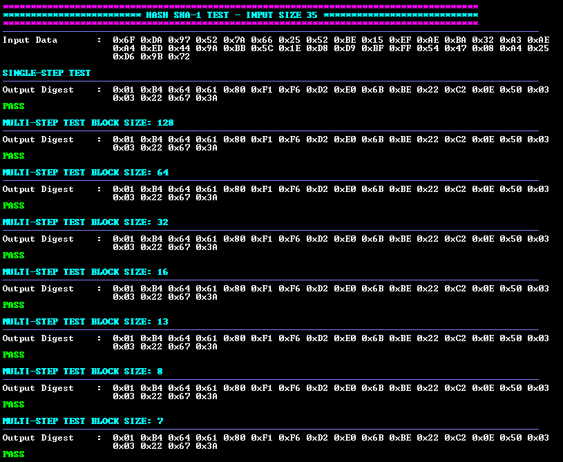

# Crypto Accelerator Module Hash Example Application
## Description
This example application utilizes the Crypto Accelerator Module Library to perform SHA hash operations using different sized input vectors. The following hash algorithms are supported:
- SHA-1
- SHA-224
- SHA-256
- SHA-384
- SHA-512

## Software Tool Versions
- dsPIC33AK-MP_DFP v1.0.81
- MPLAB® X IDE [v6.25 or newer](https://www.microchip.com/mplab-x-ide)
- MPLAB® XC-DSC Compiler [v3.21 or newer](https://www.microchip.com/xcdsc)

## Setting Up The Hardware
- dsPIC33AK512MPS512 Curiosity GP DIM ([EV80L65A](https://www.microchip.com/en-us/development-tool/EV80L65A))
- Curiosity Platform Development Board ([EV74H48A](https://www.microchip.com/EV74H48A))

1. Insert the dsPIC33AK512MPS512 DIM into the DIM J1 slot on the Curiosity Platform Development Board.
2. Connect the board from the J24 USB-C PKoB4 (PICKit™ On-Board 4) to the computer.


## Running the Application
1. Within MPLAB® X IDE, open the hash.x application project in hash/firmware. 
    - (Optional) To run all added test vectors uncomment the RUN_ALL_VECTORS definition on line 61 in hash/sha.X/app_sha.h
2. Build and Program the application using MPLAB® X IDE.
3. The printed information can be found on the serial COM port reading at a speed of 115200.

### Application Results
The following information will be printed on the COM port for all supported SHA algorithms:
1. A header is displayed showing the used SHA algorithm and input data length.
2. The input data is printed out.
3. The result digest data is printed out using the single-step API.
4. The result digest data is printed out using the multi-step API. Various block sizes are used.
5. After each test, an XOR comparison is completed of the result and expected digests. Pass or Fail is printed out depending on the comparison result.



## Common Crypto APIs
crypto_hash.h defines Digest, Init, Update, Final, and GetHashAndHashSize APIs.

```c
crypto_Hash_Status_E Crypto_Hash_Sha_Digest(
    crypto_HandlerType_E shaHandler_en, // configure Crypto API to use hardware acceleration
    uint8_t *ptr_data,                  // pointer to the input data array to be hashed
    uint32_t dataLen,                   // length of the input data array
    uint8_t *ptr_digest,                // pointer to the data array for result hash to be stored
    crypto_Hash_Algo_E shaAlgorithm_en, // configure Crypto API for desired SHA algorithm
    uint32_t shaSessionId               // session ID for use by Crypto API (maximum of 1)
);
```

```c
crypto_Hash_Status_E Crypto_Hash_Sha_Init(
    st_Crypto_Hash_Sha_Ctx *ptr_shaCtx_st, // SHA configuration context
    crypto_Hash_Algo_E shaAlgorithm_en,    // configure Crypto API for desired SHA algorithm
    crypto_HandlerType_E shaHandler_en,    // configure Crypto API to use hardware acceleration
    uint32_t shaSessionId                  // session ID for use by Crypto API (maximum of 1)
);
```

```c
crypto_Hash_Status_E Crypto_Hash_Sha_Update(
    st_Crypto_Hash_Sha_Ctx *ptr_shaCtx_st, // SHA configuration context
    uint8_t *ptr_data,                     // pointer to the input data array to be hashed
    uint32_t dataLen                       // length of the input data array
);
```

```c
crypto_Hash_Status_E Crypto_Hash_Sha_Final(
    st_Crypto_Hash_Sha_Ctx *ptr_shaCtx_st, // SHA configuration context
    uint8_t *ptr_digest                    // pointer to the data array for result digest to be stored
);
```

## Benchmarking

### Performance Benchmarking
The following benchmarking results were obtained while testing the hash driver with NIST provided test vectors.

Benchmarking parameters: Device clock speed set to 200 MHz

|Hash Algorithm|Input Size (bytes)|Crypto_Hash_Sha_Digest Performance (Mbps)|
|----|----|----|
|SHA-1|4,096|928.80|
|SHA-224|4,096|1084.67|
|SHA-256|4,096|1091.54|
|SHA-384|4,096|1294.15|
|SHA-512|4,096|1293.64|

### Memory Size Benchmarking

#### Single Step

|Hash Algorithm|RAM (bytes)|FLASH (bytes)|
|----|----|----|
|SHA-1|284|9,892|
|SHA-224|284|9,892|
|SHA-256|284|9,892|
|SHA-384|284|9,892|
|SHA-512|284|9,892|

#### Multi Step

|Hash Algorithm|RAM (bytes)|FLASH (bytes)|
|----|----|----|
|SHA-1|284|9,936|
|SHA-224|284|9,940|
|SHA-256|284|9,940|
|SHA-384|284|9,940|
|SHA-512|284|9,940|

## ACVP
The APIs have been self-tested according to the NIST ACVP specification and generated test vectors. More information can be found [here](https://pages.nist.gov/ACVP/).